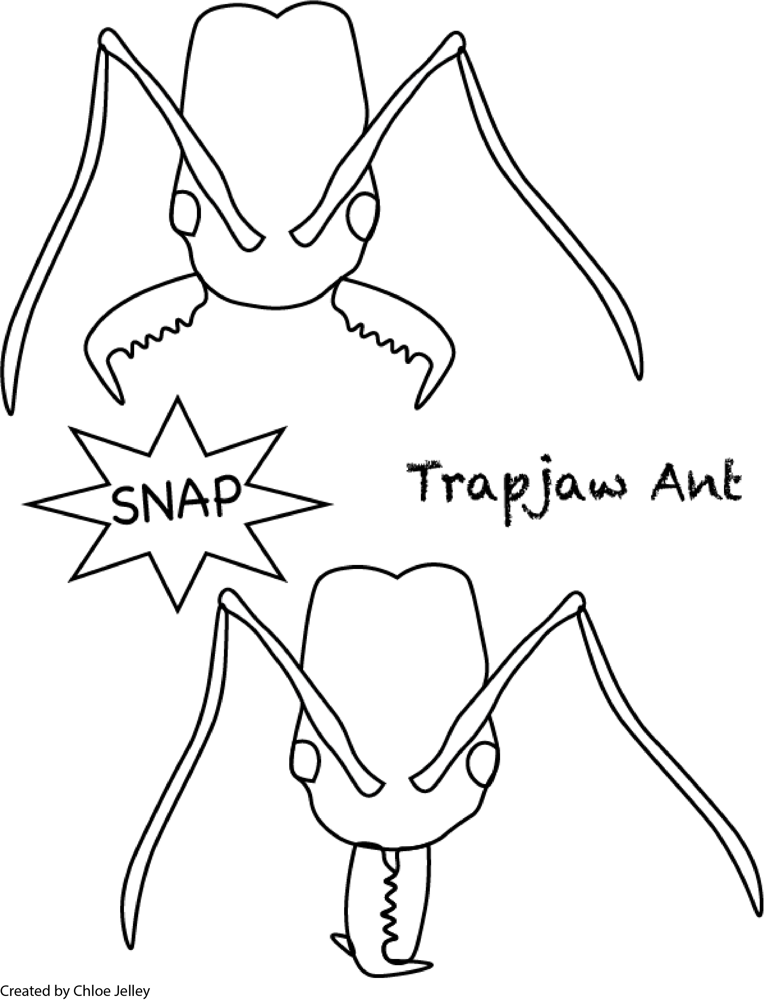
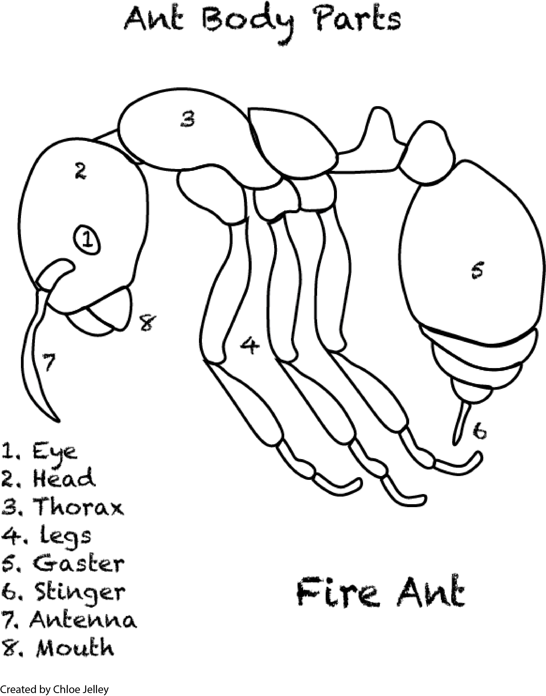

## Chloe Jelley

I am a Ph.D Student studying the ecology and evolution of ants and a member of the [Moreau Lab](https://www.moreaulab.entomology.cornell.edu/) and the Department of [Entomology](https://entomology.cals.cornell.edu/) at Cornell University. I am largely interested in the patterns of morphological diversity across ant lineages and how these patterns interact with ecological interactions and caste specialization. 

### Why ants? 

### Publications

### CV

### Outreach 
{:height="50%" width="50%"}

### Contact me 

